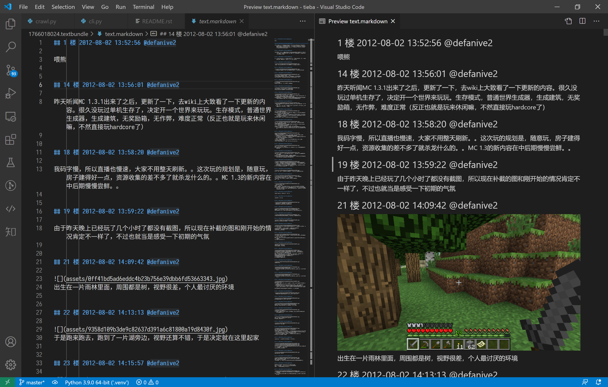

###################
百度贴吧 TextBundle
###################

将百度贴吧的指定帖子下载为 textbundle（内含一个 markdown 文本文件，图片等资源保存在 assets 文件夹中）。

使用 pip 或 pipx 安装：

.. code:: sh

    pip install tieba
    pipx install tieba

使用方法
========

.. code:: sh

    # 默认只下载楼主发布的楼层
    tieba https://tieba.baidu.com/p/1766018024

    # 包含所有回帖（楼中楼除外）
    tieba https://tieba.baidu.com/p/1766018024 --repliers

除此之外，还有两个命令行参数可以使用：

--start-fid     本次下载的起点楼层 ID（不是楼层数，是楼层的 HTML 属性 :code:`id` 所后缀的数字）
--http-proxy    通过指定的 HTTP 代理进行下载

遭遇错误
--------

在下载过程中，可能会遇到一些错误，比如百度拒绝访问。对于已经发现的报错，在程序中已经添加了相关处理代码。
对于短时间内请求过多导致百度拒绝访问的情况（error_code 239103），默认采用等待 3 分钟再继续的策略。
对于其他报错，请记录程序输出的提示，并提交到 issue 方便程序改进。

提示输出样式如下::

    xxxx/yyyy: (zzzz)

xxxx 表示帖子 ID，yyyy 表示楼层 ID，zzzz 表示错误代码。

可以将 yyyy 位置所提供的 fid 提供给命令行参数 :code:`--start-fid`，令程序从中断处继续。不过这不会删除之前已经下载的部分，可能导致下载的文本内容存在重复。

.. code:: sh

    # 这将从目标帖子的第 381 楼开始下载
    tieba https://tieba.baidu.com/p/1766018024 --start-fid 22754385957

如果反复遇到相同的错误或者开发者无法重现，可以将环境变量 :code:`DEBUG` 的值设为 :code:`1`，然后再次运行。这会在当前工作目录下生成 :code:`debug_xxx_error.json` 文件，记录了几处请求信息，可以将其提交到 issue 方便开发者调试。

.. code:: sh

    # bash/zsh 等 Unix Shell
    DEBUG=1 tieba https://tieba.baidu.com/p/1766018024
    # powershell
    $env:DEBUG = 1
    tieba https://tieba.baidu.com/p/1766018024
    # cmd.exe
    set DEBUG=1
    tieba https://tieba.baidu.com/p/1766018024

示例
====

下面的命令所下载的是 Defanive2 编写，发布在 minecraft 吧的《直播，MC 1.3 原版生存》。包含图片（7000+ 张）共 974 MB 内容，下载总耗时约 20 min，中间中断两次。

.. code:: sh

    tieba https://tieba.baidu.com/p/1766018024

    0it [00:00, ?it/s]
    抓取帖子：minecraft/直播，MC 1.3 原版生存
    正在下载 1766018024.textbundle/assets/8b82b9014a90f603c3d8fcd13912b31bb051ed38.jpg: : 86it [00:08, 10.82it/s]
    已收集楼层: 125floor [00:07, 15.77floor/s]

    下载结果的前几楼

感谢
====

使用百度贴吧 APP 的 API 接口的代码参考自 https://github.com/cnwangjihe/TiebaBackup。